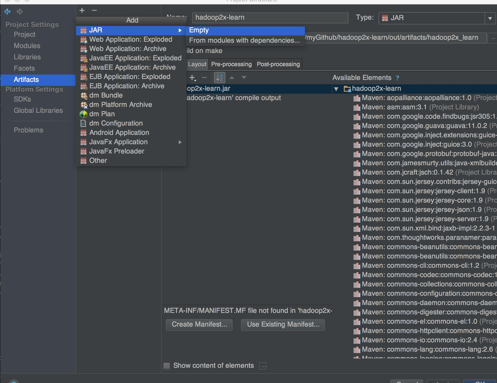
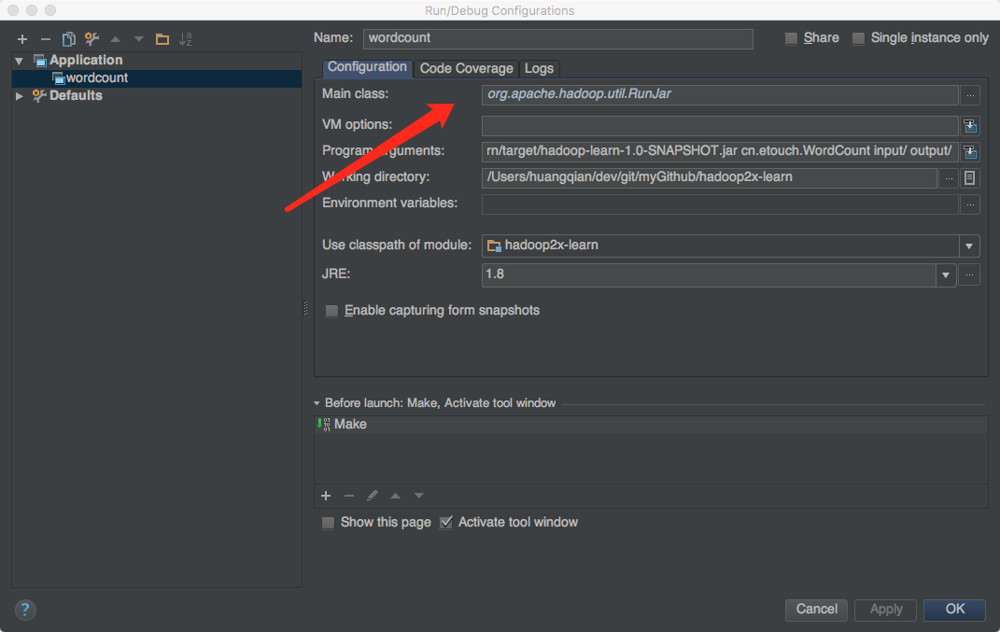
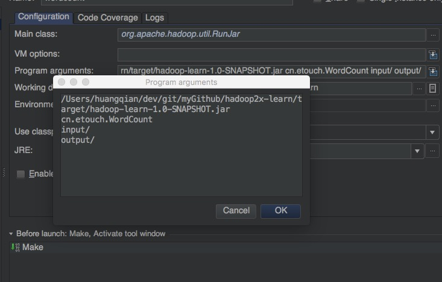
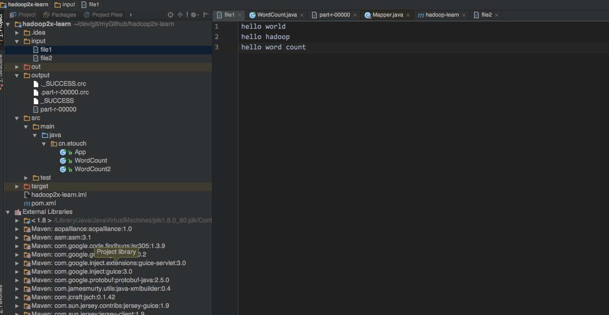
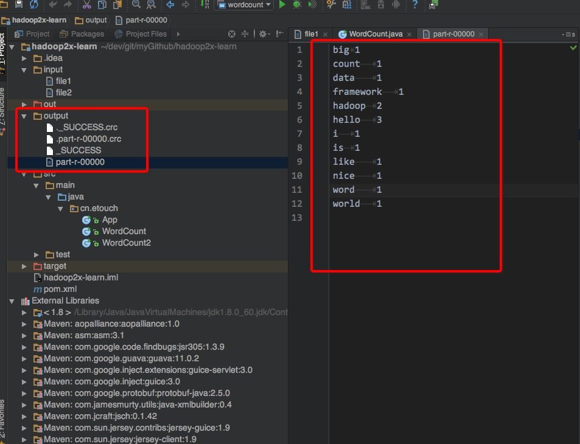

##如何在IntelliJ Idea中debug或测试mapreduce程序

### 为什么要在本地的IDE中运行mapreduce程序？

在学习和工作中，经常需要做一些demo或者测试程序。特别是在初学hadoop的时候，想在运行自己写的mapreduce，网上很多文章都是将写好的wordcount程序，扔到集群运行。这样做是没错，但是现实中，更多是需要在本地idea运行，可以debug跟踪，原因如下：

 1. 我们可能dev环境没有集群，没有搭建集群；
 2. 扔到集群上太麻烦了，我就想了解基本原理，杀鸡焉用宰牛刀；
 3. 我们想debug，跟踪程序的调用栈。

因此，本地idea运行mapreduce程序的方案就很重要了。

### 前置条件

 + 本文仅限对Mac用户。
 + 在本机上安装一个hadoop，主要下载包，配置一下Hadoop的环境变量，单机版就可以了。这个网上很多，推荐官方的文档，这里就不赘述了。

 + Java环境
 + maven 可有可无，如果项目是maven，就需要安装了，如果不想使用maven，hadoop安装目录下的share包含了运行需要的jar包了。
 + 本例使用的IDE是IntelliJ IDEA

### 创建项目

  1. 创建一个maven项目，当然你可以创建一个非maven项目，本人是自己习惯了maven来构建项目。

  2. 如果是maven项目，请在项目增加了hadoop的依赖，版本根据自己的需求选择。我这里使用的配置如下：

```
<dependencies>

    <dependency>
      <groupId>org.apache.hadoop</groupId>
      <artifactId>hadoop-common</artifactId>
      <version>2.5.2</version>
    </dependency>

    <dependency>
      <groupId>org.apache.hadoop</groupId>
      <artifactId>hadoop-mapreduce-client-core</artifactId>
      <version>2.5.2</version>
    </dependency>

    <dependency>
      <groupId>org.apache.hadoop</groupId>
      <artifactId>hadoop-client</artifactId>
      <version>2.5.2</version>
    </dependency>

    <dependency>
      <groupId>org.apache.hadoop</groupId>
      <artifactId>hadoop-hdfs</artifactId>
      <version>2.5.2</version>
    </dependency>

    <dependency>
      <groupId>org.apache.hadoop</groupId>
      <artifactId>hadoop-yarn-client</artifactId>
      <version>2.5.2</version>
    </dependency>

    <dependency>
      <groupId>junit</groupId>
      <artifactId>junit</artifactId>
      <version>4.12</version>
    </dependency>
  </dependencies>
```
  3. 如果是非maven项目（maven项目请跳过），请点击project structure -> Modules -> Dependencies 在下面导入hadoop安装目录的share目录中common、hdfs、mapreduce、yarn、lib等目录。

### coding

编码WordCount。直接使用官网例子，本文例子代码如下：

```
package cn.etouch;

import org.apache.hadoop.conf.Configuration;
import org.apache.hadoop.fs.Path;
import org.apache.hadoop.io.IntWritable;
import org.apache.hadoop.io.Text;
import org.apache.hadoop.mapreduce.Job;
import org.apache.hadoop.mapreduce.Mapper;
import org.apache.hadoop.mapreduce.Reducer;
import org.apache.hadoop.mapreduce.lib.input.FileInputFormat;
import org.apache.hadoop.mapreduce.lib.output.FileOutputFormat;

import java.io.IOException;
import java.util.StringTokenizer;


public class WordCount {

	public static class TokenizerMapper extends Mapper<Object, Text, Text, IntWritable> {

		private final static IntWritable one = new IntWritable(1);
		private Text word = new Text();

		@Override
		protected void map(Object key, Text value, Context context) throws IOException, InterruptedException {
			StringTokenizer itr = new StringTokenizer(value.toString());
			while (itr.hasMoreTokens()) {
				word.set(itr.nextToken());
				context.write(word, one);
			}
		}
	}


	public static class IntSumReducer
			extends Reducer<Text, IntWritable, Text, IntWritable> {

		private IntWritable result = new IntWritable();

		@Override
		protected void reduce(Text key, Iterable<IntWritable> values, Context context) throws IOException, InterruptedException {
			int sum = 0;
			for (IntWritable val : values) {
				sum += val.get();
			}
			result.set(sum);
			context.write(key, result);
		}
	}

	public static void main(String[] args) throws Exception {

		Configuration conf = new Configuration();
		Job job = Job.getInstance(conf, "word count");
		job.setJarByClass(WordCount.class);
		job.setMapperClass(TokenizerMapper.class);
		job.setCombinerClass(IntSumReducer.class);
		job.setReducerClass(IntSumReducer.class);
		job.setOutputKeyClass(Text.class);
		job.setOutputValueClass(IntWritable.class);
		FileInputFormat.addInputPath(job, new Path(args[0]));
		FileOutputFormat.setOutputPath(job, new Path(args[1]));
		System.exit(job.waitForCompletion(true) ? 0 : 1);
	}
}
```

### 配置Artifacts

1. 打开 project structure -> Artifacts

2. 点击`+`号，新建一个Jar的Empty的Artifacts。如下图：



3. 创建Module output，并且将Build on make勾选上


### 配置运行环境

1. 点击Edit Configuration，创建一个Application运行项目，在Main class中填写的是Hadoop的RunJar类，如下图：



2. 填写Program arguments，这里要注意jar包的位置，如下图所示：



3. 确定点击“Apply”

### 根据program argsment中的input目录，在项目中创建目录，并且将测试数据放入其中，如下图



### 编译打包，在maven的工具导航栏中，点击之行一下package。打包项目，确定生成的jar包和program argsment是否一致，如果不一致，请修改。

### 最后，就是点击执行，可以debug，运行完后，会生成一个output目录，结果在output的part-r-0000文件中，如下图：



好了，整个流程就这样。你可以参考[这篇博客](http://www.360doc.com/content/15/0505/16/175261_468257891.shtml)
